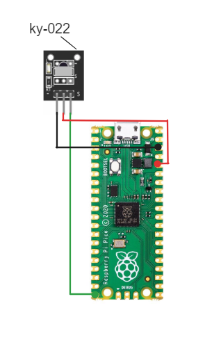

# IR CONTROLLED PC
Control your computer with Raspberry Pi Pico &amp; IR. Automate tasks, and have fun!
```You need know python for this project.```

## Connect IR to Pico
I am using the KY-022 IR module for this project. Please note that this project is specifically designed to work with the KY-022 module.

[Pinout of pico: https://datasheets.raspberrypi.com/pico/Pico-R3-A4-Pinout.pdf]

Signal (Green): GP15 / Pin 20

VCC (Red): 3v3 (OUT) / Pin 36

GND (Black): GND / Pin 38



## Uploading code to Pico
First you need install CircuitPython on your Pico.

If you already installed CircuitPython 8.x you can pass.

```WORKS ON 8.X CIRCUITPYTHON```

If you installed another UF2 then hold the bootsel button and copy ```flash_nuke.uf2``` to the Pico and continue steps.

### Installing CircuitPython
```
Hold the bootsel button on the Pico and connect it to the computer.

[Keep in my mind the uf2 file is made for Turkish. You may want to install English version from https://circuitpython.org/board/raspberry_pi_pico/ ]
Copy "adafruit-circuitpython-raspberry_pi_pico-tr-8.1.0.uf2" to the Pico.
```
### Uploading code and libraries

```Copy code.py and the lib folder to the Pico.```

You installed the code now!

For the code to work, the last step is here.

## Installing Mu editor and editing the code
```
Install Mu editor and open it.

Select CircuitPython if asked.

(If not asked, click the mode button and select CircuitPython.)

It must automatically find your Pico.

Click "Load" and select code.py on your Pico.

Open the serial monitor from the "REPL" menu.

Click buttons, and you must see the received IR code on your serial monitor.
```

You can add your commands to the code (or you can request them from ChatGPT always).
